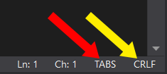

## Issues

Before posting an Issue, please do a quick search in Issues to see if a similar Issue is already created. If the documentation has a FAQ (Frequently Asked Questions), please also check out the entries there.

## Pull Requests

- Committed files in PRs aren't required to follow the repository's coding style (though if only a few lines have changed, please follow the same coding style for those changes). I may still ask you to make changes to your PR if the coding style differs a lot
- For consistency, you must [use tabs instead of spaces](https://www.youtube.com/watch?v=SsoOG6ZeyUI) (can be changed from the bottom right corner in Visual Studio, see the red arrow below)
- For consistency, you must use *Windows CRLF* line endings (can be changed from the bottom right corner in Visual Studio, see the yellow arrow below)

